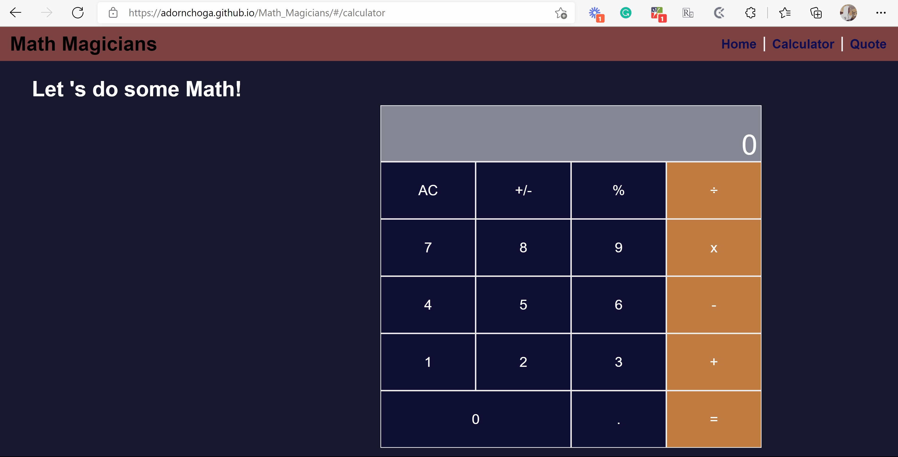

# Math_Magicians

> In this project I created a sinlge page application with all three pages (home,   calculator and quotes) being routed using React routes. The Interactivity of this website is in the navigation bar and calculator with the calculator having about 90% of the site's interactivity. The calculator has the following features:
 - +, -, x, /, % operations.
 - AC button for reseting the output display.
 - . button for decimals values.
 - -/+ button for negating numbers.

## Built With

- React
- JavaScript
- JSX
- CSS

## Live Demo

[View Live on Heroku](https://math-magician-s.herokuapp.com/)

## Getting Started

To run this application please follow these steps:

1.Clone the repo onto you local machine
  - to clone click on the green 'Code' button and copy the HTTPS link.
  -using 'git clone <link>' command clone the repository on your local machine.
2. Run `npm install` in the terminal.
3. Run `npm start` to view the webisite in you default browser or open 'dist/index.html' using Live Server extension in Visual Studio Code

## Authors
I worked on this project alone and here are my contact details

- GitHub: [@asanchy](https://github.com/Asanchy)
- Twitter: [@adorn_choga](https://twitter.com/adorn_choga)
- LinkedIn: [adorn-choga](https://www.linkedin.com/in/adorn-choga-076024201/)

## 🤝 Contributing

Contributions, issues, and feature requests are welcome!

Feel free to check the [issues page](../../issues/).

## Show your support

Give a ⭐️ if you like this project!

## Acknowledgments

- Hat tip to anyone whose code was used
- Inspiration
- etc

## 📝 License

This project is [MIT](./MIT.md) licensed.